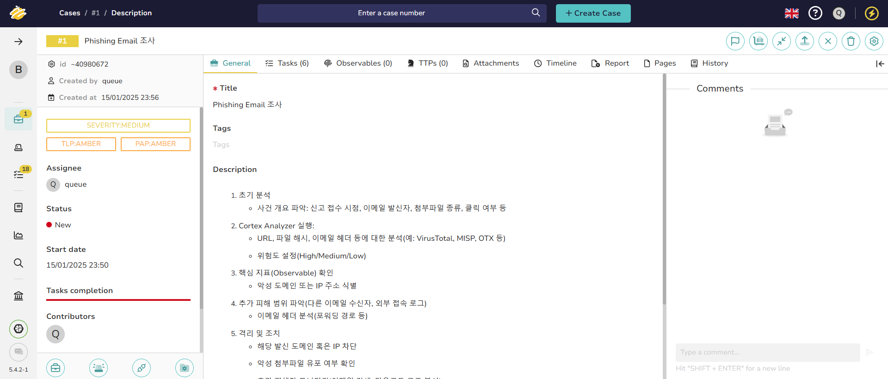
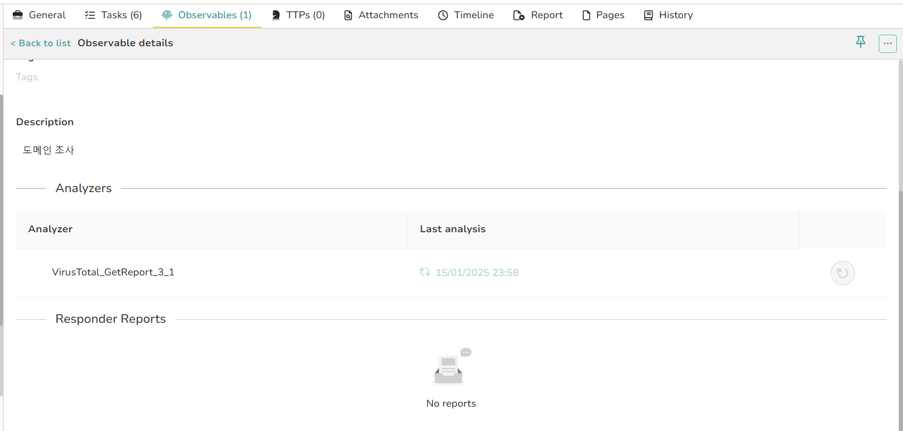

# Work Book 제작
> BoB 13기 보안 제품 개발 트랙 정민규

## 시나리오
### 피싱(Phishing) 이메일 탐지 및 대응 시나리오

**시나리오 개요**

> 보안팀 혹은 SOC팀에 “수상한 이메일을 받았다”라는 신고가 접수.
이메일에는 클릭을 유도하는 링크 혹은 악성 첨부파일이 포함
사용자가 실수로 해당 링크를 클릭하거나 파일을 열어본 상황을 가정

### 대응 절차
1. 초기 분석
    - 사건 개요 파악: 신고 접수 시점, 이메일 발신자, 첨부파일 종류, 클릭 여부 등

1. Cortex Analyzer 실행:
    - URL, 파일 해시, 이메일 헤더 등에 대한 분석(예: VirusTotal, MISP, OTX 등)
    - 위험도 설정(High/Medium/Low)

1. 핵심 지표(Observable) 확인
    - 악성 도메인 또는 IP 주소 식별

1. 추가 피해 범위 파악(다른 이메일 수신자, 외부 접속 로그)
    - 이메일 헤더 분석(포워딩 경로 등)

1. 격리 및 조치
    - 해당 발신 도메인 혹은 IP 차단
    - 악성 첨부파일 유포 여부 확인
    - 추가 피해자 모니터링(이메일 검색, 다운로드 로그 분석)
    - 사후 보고 및 문서화

1. 사건 발생 원인 및 재발 방지 대책
    - WorkBook 작업 내역 정리(정책 변경, 차단 룰 설정, 사용자 계정 교육 등)

### 내부 사용자에 의한 데이터 유출(Insider Threat) 시나리오
**시나리오 개요**
> 조직 내부 직원이 중요 자료를 무단 반출하거나 외부로 유출했다는 의심 사례 발생
내부자 위협은 조직 보안에 큰 영향을 미치므로 정확하고 세부적인 조사 절차 필요

### 대응 절차
1. 초기 인지 및 의심 사례 파악:
    - 도움을 얻을 수 있는 내부 및 외부 연락처 파악
    - 의심 사용자 및 의심 활동 식별(대량 이메일 발송, 외부 클라우드 업로드 등)

1. Cortex Analyzer:
    - 유출된 파일 해시(혹은 이메일 첨부파일) 분석
    - 의심되는 도메인/URL 분석
    - 보안 솔루션 로그 분석(DLP, CASB, Proxy 등) 추가 증거 수집

1. 내부 시스템 접근 로그(AD, 파일서버 등)
    - 이메일 로그, 메신저 로그 확보
    - 의심 사용자 PC 포렌식 필요 시 절차 진행

1. 조치 및 보고
    - 사용자 계정 임시 차단 혹은 권한 축소
    - 유출된 자료의 실제 외부 전송 여부 확인
    - 법적 절차 및 HR 협력(필요 시)

1. 사후 분석 및 개선
    - 보안 정책 및 접근 권한 재정비
    - WorkBook 수정 및 담당자 교육
    - 유출 위험 최소화를 위한 추가 보안 솔루션 검토

### 웹사이트 침해사고(Website Compromise) 시나리오
**시나리오 개요**
> 조직 공식 웹사이트가 Defacement(웹 페이지 변조) 혹은 악성코드 유포에 사용되었다고 신고
웹 서버 취약점을 통한 악성코드 심기 혹은 CMS(WordPress, Drupal 등) 취약점을 악용했을 수 있음

### 대응 절차
1. 초기 상황 파악
    - 도움을 얻을 수 있는 내부 및 외부 연락처 파악
    - 변조된 페이지 스크린샷, 로그 확보
    - 웹 서버 접근 로그 및 애플리케이션 로그 수집

1. Cortex Analyzer:
    - 웹셸(WebShell) 의심 파일 해시, IP, 도메인 등 분석
    - IoC 공유 플랫폼 연동(MISP, OTX, VirusTotal 등)

1. 격리 및 복원 조치
    - 웹서버 임시 중단 혹은 트래픽 제한
    - 심어진 악성 파일(웹셸 등) 식별 후 삭제
    - 웹 서비스 및 애플리케이션 패치 적용

1.  원인 분석
    - 침투 경로(취약한 CMS 플러그인/테마, 관리자 계정 탈취 등) 식별
    - 공격자의 추가 흔적(백도어, DB 유출 등) 확인

1. 취약점 스캔 및 개선(패치, 보안 설정 강화)

1. 사후 보고 및 개선 활동
    - 침해사고 보고서 작성 및 보안팀, 경영진 공유
    - 웹 사이트 모니터링 솔루션 강화(WAF, SIEM 연동 등)
    - WorkBook 업그레이드(취약점 점검 체크리스트 추가)

### 의심스러운 네트워크 트래픽 발생 시나리오
**시나리오 개요**
> IDS/IPS나 방화벽 로그에서 비정상적인 네트워크 트래픽이 감지됨
특정 IP 혹은 포트로 외부 데이터가 대량 전송되는 정황이 포착됨

### 대응 절차
1. 경고(Alert) 파악
    - 어떤 보안 장비(IDS/IPS/Firewall)에서 Alert가 발생했는지 확인
    - 세션 시간, 소스/목적지 IP, 프로토콜 등 주요 정보 수집
1. Cortex Analyzer:
    - 의심 IP, 도메인, 해시 분석(알려진 악성 IP/도메인인지 확인)
    - 분석 범위 확장

1. 관련 호스트/서버 로그 분석(시스템 접근로그, 애플리케이션 로그)
    - 동일한 IP로의 다른 세션 존재 여부 확인
    - Inbound / Outbound 트래픽 유형 파악(데이터 업로드, 쉘 연결 등)

1. 대응 및 격리
    - 악성으로 판명된 경우 방화벽 정책으로 차단, 호스트 격리
    - 동일한 로그 패턴이나 IP를 사용하는 다른 장비 모니터링

1. 사후 보고 및 예방
    - 내부 자산 취약점 스캐닝 및 패치
    - WorkBook에 네트워크 공격 유형별 체크리스트 추가
    - 보안 정책 및 대응 자동화(Playbooks) 연계 방안 마련

## 시스템 구축

위의 시나리오와 동일하게 시나리오들을 템플릿으로 구축해보았습니다.

특정 값들을 검증할 수 있는 observables을 등록하여 자동화하였습니다.

해당 자동화가  정상 동작함을 확인하였습니다.

해당 값이 Cortex에서도 보여짐을 확인하였습니다.

이러한 진행사항이 보고서로도 출력됨을 확인하였습니다.

